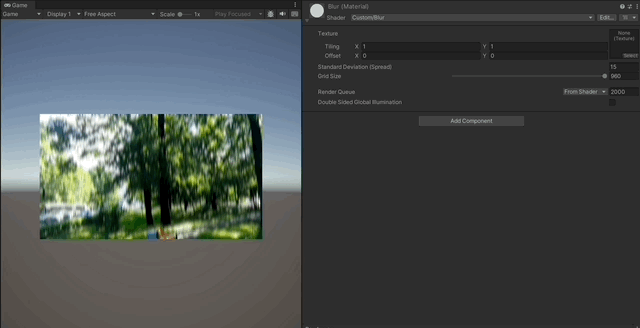
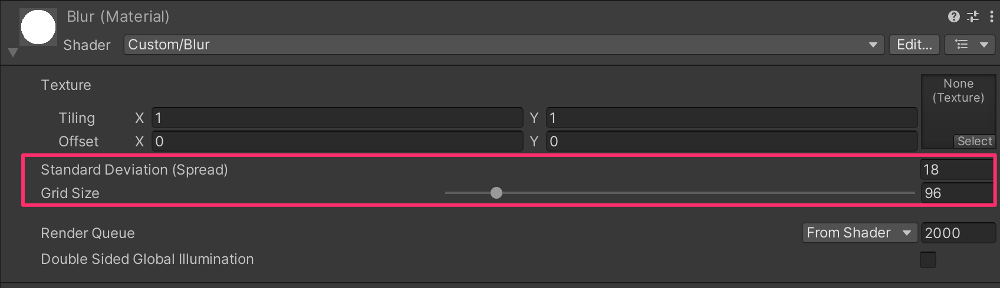

# VideoBlur

## Description
This is a sample project to blur a video using Unity Shader. Blur algorithm is box blur (O(2n)).

## How to use
`Custom/Blur` shader has 2 parameters: `Standard Deviation (Spread)` and `Grid Size`.

`Standard Deviation (Spread)` is the standard deviation of Gaussian distribution. The larger the value, the more blurred the image. 

`Grid Size` is the size of the grid to sample the pixels. The larger the value, the more accurate the blur is. However, the larger the value, the more expensive the computation is.

## Appendix
Sample video used in this project is downloaded from [here](https://samplelib.com/sample-mp4.html) (license free).
